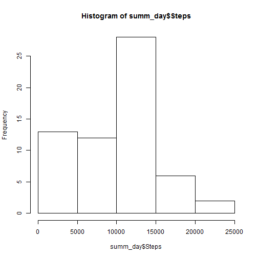
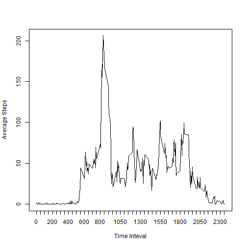
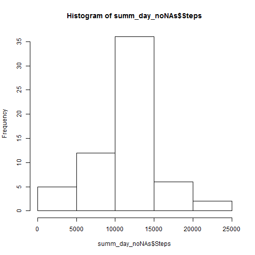
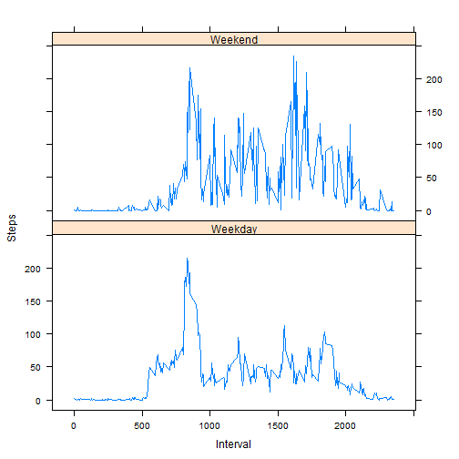

Assignment 1

===========

#### Loading and preprocessing the data

Load the csv file activity.csv. Make sure it is in your working directory.


```r
activity <- read.csv("activity.csv")
```

#### What is mean total number of steps taken per day?

1. Calculate the total number of steps taken per day.


```r
summ_day<-aggregate(activity$steps, by=list(date=activity$date), FUN=sum,na.rm=TRUE)
colnames(summ_day)[2] <-"Steps"
summ_day
```

```
##          date Steps
## 1  2012-10-01     0
## 2  2012-10-02   126
## 3  2012-10-03 11352
## 4  2012-10-04 12116
## 5  2012-10-05 13294
## 6  2012-10-06 15420
## 7  2012-10-07 11015
## 8  2012-10-08     0
## 9  2012-10-09 12811
## 10 2012-10-10  9900
## 11 2012-10-11 10304
## 12 2012-10-12 17382
## 13 2012-10-13 12426
## 14 2012-10-14 15098
## 15 2012-10-15 10139
## 16 2012-10-16 15084
## 17 2012-10-17 13452
## 18 2012-10-18 10056
## 19 2012-10-19 11829
## 20 2012-10-20 10395
## 21 2012-10-21  8821
## 22 2012-10-22 13460
## 23 2012-10-23  8918
## 24 2012-10-24  8355
## 25 2012-10-25  2492
## 26 2012-10-26  6778
## 27 2012-10-27 10119
## 28 2012-10-28 11458
## 29 2012-10-29  5018
## 30 2012-10-30  9819
## 31 2012-10-31 15414
## 32 2012-11-01     0
## 33 2012-11-02 10600
## 34 2012-11-03 10571
## 35 2012-11-04     0
## 36 2012-11-05 10439
## 37 2012-11-06  8334
## 38 2012-11-07 12883
## 39 2012-11-08  3219
## 40 2012-11-09     0
## 41 2012-11-10     0
## 42 2012-11-11 12608
## 43 2012-11-12 10765
## 44 2012-11-13  7336
## 45 2012-11-14     0
## 46 2012-11-15    41
## 47 2012-11-16  5441
## 48 2012-11-17 14339
## 49 2012-11-18 15110
## 50 2012-11-19  8841
## 51 2012-11-20  4472
## 52 2012-11-21 12787
## 53 2012-11-22 20427
## 54 2012-11-23 21194
## 55 2012-11-24 14478
## 56 2012-11-25 11834
## 57 2012-11-26 11162
## 58 2012-11-27 13646
## 59 2012-11-28 10183
## 60 2012-11-29  7047
## 61 2012-11-30     0
```

2.Make a histogram of the total number of steps taken each day.

```r
hist(summ_day$Steps)
```

 

3.Calculate and report the mean and median of the total number of steps taken per day.


```r
mean(summ_day$Steps)
```

```
## [1] 9354.23
```

```r
median(summ_day$Steps)
```

```
## [1] 10395
```


#### What is the average daily activity pattern?

1. Make a time series plot (i.e. type = "l") of the 5-minute interval (x-axis) and the average number of steps taken, averaged across all days (y-axis)


```r
avg_interval<-aggregate(activity$steps, by=list(interval=activity$interval), FUN=mean,na.rm=TRUE)
colnames(avg_interval)[2] <-"Steps"
plot(avg_interval$interval,avg_interval$Steps,xlab="Time Inteval", ylab="Average Steps", type="l",xaxt ="n")
at <- seq(from = 0, to = max(avg_interval$interval), by = 50)
axis(side = 1, at = at)
```

 

2.Which 5-minute interval, on average across all the days in the dataset, contains the maximum number of steps?

```r
subset(avg_interval,avg_interval$Steps == max(avg_interval$Steps))
```

```
##     interval    Steps
## 104      835 206.1698
```


#### Inputing missing values

1. Calculate and report the total number of missing values in the dataset (i.e. the total number of rows with NAs)


```r
nrow(subset(activity,is.na(activity$steps)))
```

```
## [1] 2304
```

2. Devise a strategy for filling in all of the missing values in the dataset. The strategy does not need to be sophisticated. For example, you could use the mean/median for that day, or the mean for that 5-minute interval, etc.

```r
##Merge the 2 datasets. ie the original and the average steps by interval
merge_activity <-merge(activity,avg_interval,by=c("interval"))
colnames(merge_activity)[4] <-"avg_steps"
##For any NAs replace it with the interval mean
merge_activity$steps[is.na(merge_activity$steps)]<-merge_activity$avg_steps[is.na(merge_activity$steps)] 
##Remove the additional column
merge_activity <-subset(merge_activity, select = -c(avg_steps)) 
```

3. Create a new dataset that is equal to the original dataset but with the missing data filled in.

```r
## Display new data frame
head(merge_activity,100)
```

```
##     interval      steps       date
## 1          0  1.7169811 2012-10-01
## 2          0  0.0000000 2012-11-23
## 3          0  0.0000000 2012-10-28
## 4          0  0.0000000 2012-11-06
## 5          0  0.0000000 2012-11-24
## 6          0  0.0000000 2012-11-15
## 7          0  0.0000000 2012-10-20
## 8          0  0.0000000 2012-11-16
## 9          0  0.0000000 2012-11-07
## 10         0  0.0000000 2012-11-25
## 11         0  1.7169811 2012-11-04
## 12         0  0.0000000 2012-11-08
## 13         0  0.0000000 2012-10-12
## 14         0  0.0000000 2012-10-30
## 15         0  0.0000000 2012-11-26
## 16         0 47.0000000 2012-10-04
## 17         0  0.0000000 2012-11-27
## 18         0  0.0000000 2012-10-31
## 19         0  0.0000000 2012-11-18
## 20         0  0.0000000 2012-10-05
## 21         0  0.0000000 2012-10-14
## 22         0  0.0000000 2012-10-23
## 23         0  0.0000000 2012-11-19
## 24         0  0.0000000 2012-10-11
## 25         0  0.0000000 2012-10-15
## 26         0  0.0000000 2012-10-06
## 27         0  0.0000000 2012-11-11
## 28         0  0.0000000 2012-11-29
## 29         0  0.0000000 2012-11-02
## 30         0  0.0000000 2012-10-07
## 31         0  0.0000000 2012-11-03
## 32         0  1.7169811 2012-11-30
## 33         0  0.0000000 2012-11-21
## 34         0  0.0000000 2012-10-02
## 35         0  0.0000000 2012-10-26
## 36         0  0.0000000 2012-11-22
## 37         0  0.0000000 2012-11-28
## 38         0  0.0000000 2012-11-13
## 39         0  0.0000000 2012-10-18
## 40         0  0.0000000 2012-10-27
## 41         0  1.7169811 2012-11-14
## 42         0 10.0000000 2012-10-22
## 43         0 34.0000000 2012-10-10
## 44         0  0.0000000 2012-10-19
## 45         0  1.7169811 2012-11-09
## 46         0  0.0000000 2012-10-17
## 47         0  0.0000000 2012-10-16
## 48         0  0.0000000 2012-10-29
## 49         0  1.7169811 2012-11-01
## 50         0  0.0000000 2012-10-21
## 51         0  1.7169811 2012-11-10
## 52         0  0.0000000 2012-10-03
## 53         0  0.0000000 2012-11-17
## 54         0  0.0000000 2012-11-12
## 55         0  0.0000000 2012-10-25
## 56         0  0.0000000 2012-10-13
## 57         0  0.0000000 2012-10-24
## 58         0  1.7169811 2012-10-08
## 59         0  0.0000000 2012-11-20
## 60         0  0.0000000 2012-11-05
## 61         0  0.0000000 2012-10-09
## 62         5  0.0000000 2012-10-13
## 63         5  0.3396226 2012-10-01
## 64         5  0.0000000 2012-11-18
## 65         5  0.0000000 2012-10-05
## 66         5  0.0000000 2012-11-29
## 67         5  0.0000000 2012-11-25
## 68         5  0.3396226 2012-11-04
## 69         5  0.0000000 2012-11-02
## 70         5  0.0000000 2012-11-23
## 71         5  0.0000000 2012-11-06
## 72         5  0.0000000 2012-10-21
## 73         5  0.0000000 2012-11-21
## 74         5  0.0000000 2012-11-15
## 75         5  0.0000000 2012-11-16
## 76         5  0.3396226 2012-11-30
## 77         5  0.0000000 2012-10-11
## 78         5  0.0000000 2012-11-13
## 79         5  0.0000000 2012-10-15
## 80         5  0.0000000 2012-11-19
## 81         5  0.0000000 2012-11-11
## 82         5  0.3396226 2012-11-14
## 83         5  0.0000000 2012-11-26
## 84         5  0.0000000 2012-10-28
## 85         5  0.0000000 2012-11-24
## 86         5  0.3396226 2012-11-09
## 87         5  0.0000000 2012-10-22
## 88         5  0.0000000 2012-10-16
## 89         5  0.3396226 2012-10-08
## 90         5  0.0000000 2012-11-28
## 91         5  0.3396226 2012-11-10
## 92         5  0.0000000 2012-10-23
## 93         5  0.0000000 2012-10-03
## 94         5  0.0000000 2012-10-27
## 95         5  0.0000000 2012-11-20
## 96         5  0.0000000 2012-10-06
## 97         5  0.0000000 2012-10-30
## 98         5  0.0000000 2012-10-31
## 99         5 18.0000000 2012-10-10
## 100        5  0.0000000 2012-11-03
```

4. Make a histogram of the total number of steps taken each day and Calculate and report the mean and median total number of steps taken per day. Do these values differ from the estimates from the first part of the assignment? What is the impact of imputing missing data on the estimates of the total daily number of steps?


```r
summ_day_noNAs<-aggregate(merge_activity$steps, by=list(date=merge_activity$date), FUN=sum)
colnames(summ_day_noNAs)[2] <-"Steps"
hist(summ_day_noNAs$Steps)
```

 

```r
## Mean
mean(summ_day_noNAs$Steps)
```

```
## [1] 10766.19
```

```r
##Meadian
median(summ_day_noNAs$Steps)
```

```
## [1] 10766.19
```
The mean and medeian are now the same. They are now higher compared to the mean and median when NAs were ignored.


#### Are there differences in activity patterns between weekdays and weekends?

1. Create a new factor variable in the dataset with two levels - "weekday" and "weekend" indicating whether a given date is a weekday or weekend day.

```r
merge_activity$weektype <- as.factor(ifelse(weekdays(as.POSIXct(merge_activity$date))== c("Saturday","Sunday"), "Weekend","Weekday"))
```


2.Make a panel plot containing a time series plot (i.e. type = "l") of the 5-minute interval (x-axis) and the average number of steps taken, averaged across all weekday days or weekend days (y-axis). See the README file in the GitHub repository to see an example of what this plot should look like using simulated data.


```r
avg_steps_by_weektype_interval<-aggregate(merge_activity$steps, by=list(type=merge_activity$interval,merge_activity$weektype), FUN=mean)
colnames(avg_steps_by_weektype_interval)[1] <-"Interval"
colnames(avg_steps_by_weektype_interval)[2] <-"Weektype"
colnames(avg_steps_by_weektype_interval)[3] <-"Steps"

library(lattice)

xyplot(Steps ~ Interval|Weektype, data=avg_steps_by_weektype_interval, layout=c(1,2),type="l")
```

 
